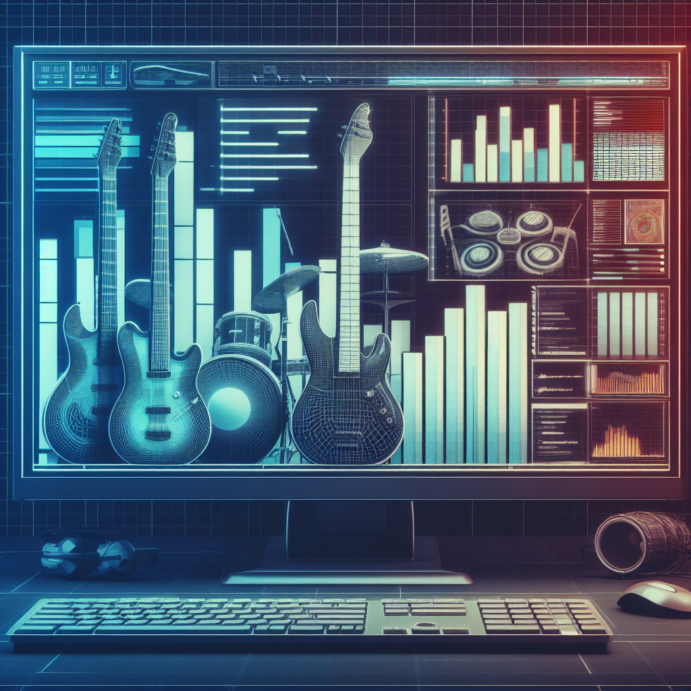

## Machine Learning | Data Scientist | Industrial Engineer 

I am an industrial engineer with experience in the construction and mass production industry. 
The skills I have acquired along this journey are now being utilized to analyze data in the realm of music, encompassing aspects such as concerts, trends, and other related elements

## **Technical Skills**

* **Programming Languages:** Python, R, SQL
* **Data Science and Machine Learning:** Scikit-learn, Pandas, Matplotlib, NumPy
* **Web Scraping:** Beautiful Soup, Selenium
* **Cloud Computing:** AWS, Google Cloud

Please let me know if you would like me to generate code for any of these technologies.

